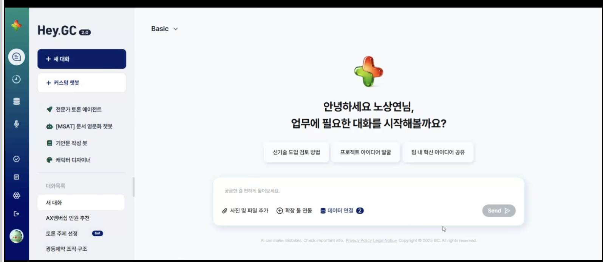

# GC녹십자

상태: 협상
구분: B2B
업무: 진행중
PM: 강은숙(모두연)
연구원: 영광 김
협의예산 (VAT별도): ₩29,000,000
교육 건 수: 0
교육 시간: 0
누적 수강생: 0
기업유형: 대기업
전체 참여 인력: 영광 김 강은숙(모두연)
문의 접수 일자: 2026/05/12

<aside>

- **기초 상담 요청 정보**
    
    **고객 정보**
    
    - 기업명: GC녹십자
    - 담당자: 노상연
    - 이메일: [[고객담당자 이메일 비공개]](mailto:[고객담당자 이메일 비공개])
    
    **교육 요청 정보**
    
    - 교육 대상자: 회사의 AX추진 챔피언
    - 교육 인원: 30명
    - 교육 일수: 미정
    - 교육 유형: 기타 (상세내용 하단 작성)
    - 희망 주제: [C-Level] AI 기반 전략적 의사결정,[비개발자] 생성형 AI 입문과 실무 활용,[비개발자] 데이터 분석과 리서치 자동화
    - 예산: 미정
    - 추가 요청사항: 아래 내용에 대해 제안 받고 싶습니다.
    
    1. 임원 대상 AX 교육 
    
    - 최대 3시간, 생성형AI 기본 교육 '25년 완료, 짧게라도 바이브코딩을 직접해볼 수 있었으면 함
    - 변화를 느끼고 의사결정의 속도가 곧 실행의 속도임을 인식할 수 있었으면 함
    
    2. 조직 내 챔피온 대상 AX 교육
    
    - AI 활용을 위한 디자인 씽킹, AI 심화 교육 진행
    - 실제 조직 성과로 이어질 수 있는 Use-case 발굴
    - 동일 인원 대상 3~4회 정도의 교육 진행 가능
- 기업 기초 자료
    - 산업 :
    - 최근 동향 및 기사
</aside>

## 유선 상담

### 고객사 담당자 :

### 통화 일시 : 26.05.12

### 1. 목적/목표/고객니즈

- *예시: 임직원의 디지털 리터러시 향상, 엔지니어 직무 역량 강화*
- *교육 유형: 직무교육 / 공통교육 등*

<aside>

1. 임원 대상 AX 교육 

- 최대 3시간, 생성형AI 기본 교육 '25년 완료, 짧게라도 바이브코딩을 직접해볼 수 있었으면 함
- 변화를 느끼고 의사결정의 속도가 곧 실행의 속도임을 인식할 수 있었으면 함
- 아이디어가 결과로 구현될 수 있는지, 쉬운 툴로 결과물 구현 실습 위주

2. 조직 내 챔피온 대상 AX 교육

- AI 활용을 위한 디자인 씽킹, AI 심화 교육 진행
- 실제 조직 성과로 이어질 수 있는 Use-case 발굴
- 동일 인원 대상 3~4회 정도의 교육 진행 가능
</aside>

### 2. 교육 대상 및 규모

- *예시: 전 직원 대상 100명, 5회차 / FE·BE 개발자 20명 등*

<aside>

1. 임원 대상 AX 교육 

- 대상 :
- 규모
- 임원들 교육 : 대표도 참석, 각자 리더분들이 각자 조직의 과제를 가져가야 할지. 변화에 대한 고민 시간도 포함
- 3시간 6월 중 진행 /

2. 조직 내 챔피온 대상 AX 교육

- 각실 본부 대표들 멘토링 과제같은거 해보고, 연말에는 신청받고, 일부 과제 결과물
    - 자동화, 데이터 취합, 파이썬 코드로 조작, 사내 AI 챗봇, 루틴 작업
        - 사내 AI 툴?
    - 4월 AX 조직이 생김. 디지털 혁신팀 소속이었다가 AX Unit이 생김. 좀더 적극적으로 하려고 하고 잇음
    - 구성원 교육이 작년에는 단타로 교육이 끝남
    - 올해는 멤버쉽 30명정도 신청 받아서 6월 9월 3~4회 교육 진행 원함
    - 미니 해커톤 원함
    - 10월 : 전사 대상 해커톤 진행 원함
        - 보조코치가 와줬으면 좋겠음
    - 유닛장이 새로 오심
        - 구성원 멤버쉽 교육했을 때, 디자인 씽킹을 꼭했으면 좋겠다 라고 언급함
- 구성원들이 과제를 키워보고
- 문제점 :
    1. 사례가 개인에 머물러 잇었음. 올해는 조직적 차원이 나왔으면 좋겠음
    2. 작년보다 AX가 바꼈으니, 따라가자 
    3. 플랫폼팀도 생겼기 때문에, 1차 프로토가 생기면 내부에서 고도화 하는 역할이 할 수 있음 
    4. 1차적인 결
</aside>

### 9. 예산(비용)

- *대략적인 예산 범위*

<aside>

정해진 예산이 없음

작년 일반 직원들 교육 시간 50만원

임원 23

- 3시간 = 150만원

일반 30

3-4일 8시간 = 400만원

</aside>

### 10. 기타 사항

- *보안 관련 요구사항 (보안 프로그램, 네트워크 등)*
- *ChatGPT, Google 등 특정 도구 사용 제한 여부*

<aside>

</aside>

## 비고

<aside>

</aside>

[미팅 히스토리 ](%EB%AF%B8%ED%8C%85%20%ED%9E%88%EC%8A%A4%ED%86%A0%EB%A6%AC%2035a137efedf682bdbc3d010fffc434f0.csv)

[업무 관리](%EC%97%85%EB%AC%B4%20%EA%B4%80%EB%A6%AC%20360137efedf68003ac34cbb646a54729.csv)

## 드라이브 / https://drive.google.com/drive/u/0/folders/1ACbGBUZWtMnV-s5om8VKRolL_-9P-vwy

## 제안 사항

---

### **초기 제안**

1. 견적서 / https://docs.google.com/spreadsheets/d/10hPbjd61x1eVtbosyPt5IyUzFiQpdaUSOGLjZbd8MMo/edit?gid=850095922#gid=850095922
2. 교육 제안서 / https://drive.google.com/drive/u/0/folders/1utBtu-cMBScGY8nviW9h_Lr35Ocg6QR1
3. **리더를 위한 AX 교육 (3시간 / 임원 대상)**
    - AI 전환 시대에 임원이 직접 활용 가능한 Claude 기반 의사결정·보고 역량 확보
    - 각 리더가 본인 조직의 실제 과제를 가져와 실습에 적용하는 방식으로 진행되며, 결과물로 조직별 임원 AI 활용 로드맵 초안이 도출됩니다.
4. **전사 AX 멤버십 교육 (월 1회 7시간 × 4개월 / 총 28시간)**
    - 바이브 코딩을 통해 직접 나만의 AI 비서를 만들고, 웹/앱 결과물까지 완성하는 실습 중심 과정입니다.
5. **전사 AX 해커톤 (1일 / 8시간)**
    - 팀 단위로 아이디어 빌딩부터 MVP 구현, 발표까지 한 사이클을 완주하는 압축형 과정입니다.

### **0527 피드백 회의**

1. 0527 액션 플랜
    1. 임원 교육 3차수 커리큘럼 조정 @영광 김 
    2. 구성원교육 디자인 씽킹, 해커톤 시수 추가 @강은숙(모두연) 
    3. 최종 견적서 수정 @강은숙(모두연) 
- 0527 회의록 @영광 김
    
    [https://claude.ai/share/0aeab58f-758e-4684-9235-f0220b2b4b26](https://claude.ai/share/0aeab58f-758e-4684-9235-f0220b2b4b26)
    
    **추가 논의 필요사항**
    
    ### 5/27 저녁 5시 @영광 김
    
    1. 임원교육
        1. 3시간 x 3회
        2. 후보 강사진 2분 
    2. 구성원 교육 (30명) (멤버십 교육)
        1. 앞 디자인 씽킹 4시간
        2. 마지막 미니해커톤 4시간
        3. 후보강사진 2분
    3. 견적
        1. 임원교육, 구성원교육 수정
    4. 기타
        1. 모두콘 소개
    
    1) 임원 교육 수정 필요
    
    - `임원 대상인만큼 시연/실습의 비중을 적절한 수준으로 조정 필요`
        - 실습의 비중이 너무 높으면, 어려움
        - 기업에서 AX를 활용해서 AI로 함께 일하는 판을 짜고, 검증하고 진행하는
    - `강사진 논의 필요`
        - 이 과정을 잘 할 수 있는 2-3분 정도 추려서
        - 후보군
            - 수리과학연구소 박사님 > 연구쪽을 하시면서
            - 워크숍 형태로, AI 형태로 판을 짤 것인가? 라는 주제
        - 담당자 의견
            - 직접 해보지 않으면 체감이 안됨
            - 임원이라도 클로드 활용해서 간단한 것이라도 체험 → 워크숍 형태
            - 모두연을 알게된 계기: 주변 지인의 추천. 유닛장님이 디자인씽킹을 꼭 넣었으면 좋겟다.
        - 니즈
            - 대표님도 임원대상 교육을 항상 참석함
            - 실무진만 하면 아무것도 안됨, 임원들도 변화의 교육을 듣고 실행하게 하고 싶음
            - GWS 유닛장 이상들은 모두 쓰게 하고 잇음
        - 정리 → 5/28 오전
            - **강사진 추천. 과정을 워크숍 형태로 진행하는 형태**
            - **일정 : 6월말, 7월말, 8월말**
            - **교육 커리큘럼 다회차 → 3시간씩 3번**
            - 작년업체는 파이썬의 코드를 뽑아내거나, 이런 형태로 했음
            - **니즈: 임원분들도 최신 AI 툴들을 활용하고, 임직원들에게도 독려할 수 잇는 환경 구축을 하고 싶다.**
            - 1회성 교육 말고, 해커톤의 결과물을 끝점으로 생각해서 2-3번 가면 좋겠다. 최소 2~3회차수 (1, 2, 3 하면서 진도를 나가고 과제를 주는 것도 좋음)
            - 내부의 헤이지스 AI를 쓰고 잇음(사내툴) → 실제 배포까지는 아니고 특정한 실습 데이터 사용할 수 있는 것
            - 사내툴 : 병행해서 교육 하는 방법, 데이터에 대한 접근 허용이 있기 때문에
                - 외부에서는 접속이 잘 안됨
                - **Hey GC + 클로드 활용한 교육 / Hey GC 꼭 써야하는건 아님**
                
                
                
    
    2) 구성원 교육 수정 필요 
    
    - `해커톤에 포함되어 있는 '디자인씽킹' 관련 내용 전 직원 내용에 포함 필요`
    - `마지막 일정 미니해커톤 포함하여 7시간 * 4회 구성으로 수정 필요`
    - 논의 사항
        - 6월 중에는 시작 예정
        - 해커톤에 들어가 있는 디자인씽킹 내용을 AX 교육에도 디자인씽킹 과정이 들어가면 좋겠음
        - **7시간씩 4회**
            - **앞 : 디자인씽킹 (4시간)**
            - **마지막 : 미니 해커톤 (4시간)**
        - 제약사항 : 사내컴퓨터라 보안 이슈는 있을 수 잇음
            - 코덱스, 클로드 데스크탑 다운로드 가능?
            - 열어달라고 사전에 요청할 예정
            - MS 365 쓰고 잇음 → 이중심으로 구성 필요. 구글 시트 연결 안됨
        - 교육 대상
            - 기술 교육, 과제 하고 싶은 사람들 신청 받음
            - 30명 선발, 129명 지원. 과제를 보고 선정
            - 다음주 결론나면 어떤 부문의 인원인지 선발 결과 공유 예정
        - **마지막 해커톤에 이 30명을 코치로 투입 예정**
            - 지난해 모두콘에서 동그라미 재단에서 발표했음
    
    3) 견적
    
    - `실습을 위한 AI 인프라 셋팅에 대한 상세 설명 필요`
        - 현재 클로드 팀플랜을 해당 팀에서는 사용하고 있으나
        - 교육 기간동안에
- 추가논의 > 쓸수 잇는 툴
    - Gemini, 노트북 LM (파일 업로드 가능)
    - GWS 비즈니스 모델로 사용중
    
    ## 논의 사항
    
    1. 트렌드에 맞는 내용을 주신 것 같아서 구체적인 내용