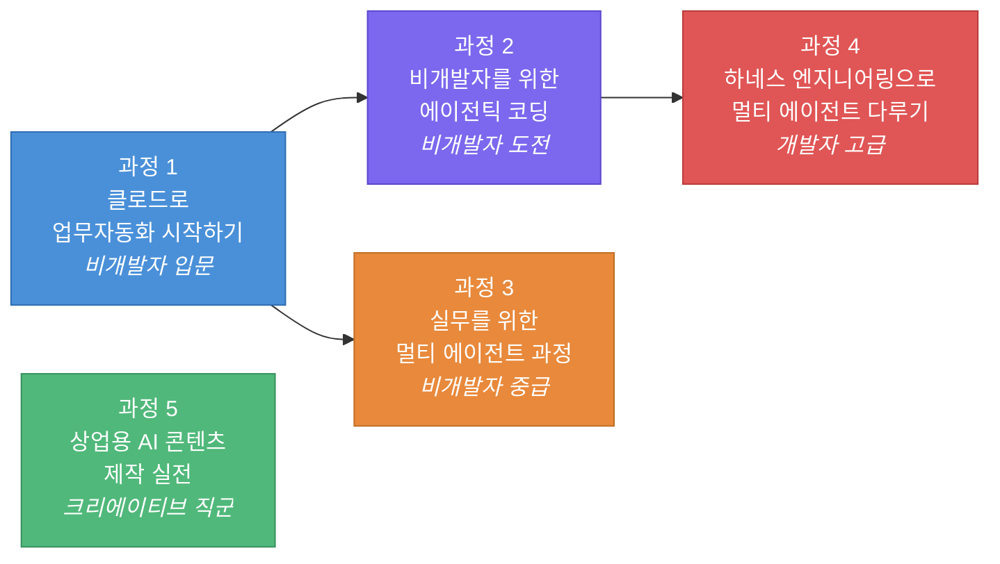

# 중소기업 인재양성 프리미엄 — 교과목별 훈련 목표 · 훈련 대상 · 과정 소개

---

## 과정 1. 클로드로 업무자동화 시작하기 (6H)

> **말로 시키면 끝, AI 비서에게 일 맡기기: Cowork & Skill 실전**

### 훈련 목표

| 구분 | 내용 |
|------|------|
| **최종 목표** | Claude Cowork과 Skill을 활용하여 반복 업무를 자연어 명령만으로 자동화하고, 스케줄 기반 완전 자동화 루틴을 독립적으로 구축할 수 있다. |
| **세부 목표 1** | Cowork의 에이전트형 작업 모드를 이해하고, 데스크톱 파일/폴더에 직접 접근하는 AI 비서 환경을 설치·설정할 수 있다. |
| **세부 목표 2** | 문서 추출, 데이터 정리, 리포트 생성 등 실무 업무를 자연어 지시로 자동화하며, 브라우저 연동과 플러그인 활용 방법을 실습한다. |
| **세부 목표 3** | 반복 작업을 Skill로 저장하고 스케줄 자동화를 등록하여, 매일/매주 자동 실행되는 업무 루틴을 완성할 수 있다. |

### 훈련 대상

| 항목 | 내용 |
|------|------|
| **대상 직무** | 사무·경영지원, 기획, 총무, 인사, 마케팅 등 반복 문서 업무가 많은 직무 |
| **대상 수준** | 코딩 경험이 전혀 없는 비개발자 (코딩 제로 과정) |
| **선수 지식** | PC 기본 조작 가능, 별도 프로그래밍 지식 불요 |
| **권장 대상** | · 엑셀 정리, 보고서 작성, 데이터 취합 등 반복 업무에 시간을 많이 쓰는 실무자 · AI 도구를 처음 접하지만 업무 효율화에 관심이 높은 중소기업 임직원 · ChatGPT 등 채팅형 AI는 써봤지만, 파일을 직접 다루는 에이전트형 AI는 처음인 분 |

### 과정 소개

**"코딩 한 줄 없이, 말 한마디로 일하는 AI 비서를 만들어 보세요."**

본 과정은 프로그래밍 경험이 전혀 없는 비개발자를 위해 설계된 **AI 업무 자동화 입문 과정**입니다. Claude Desktop의 Cowork 기능을 활용하면, 채팅에 답만 하던 AI가 여러분의 데스크톱 파일을 직접 읽고, 정리하고, 새로 만들어주는 **'일하는 AI'**로 전환됩니다.

- **Module 1**에서는 Cowork을 설치하고, 폴더 접근 권한과 안전 장치를 설정하여 AI 비서가 일할 수 있는 환경을 구축합니다.
- **Module 2**에서는 PDF 데이터 추출, 경비 보고서 자동 생성, 다국어 번역 등 실무 시나리오를 자연어 명령만으로 자동화합니다.
- **Module 3**에서는 성공적인 자동화 작업을 **Skill로 저장**하고, 매일/매주 자동 실행되는 **스케줄 자동화까지 완성**합니다.

이 과정을 마치면, 매일 30분씩 들이던 반복 업무를 AI에게 맡기고 더 중요한 일에 집중하는 스마트한 업무 환경을 경험하게 됩니다.

---

## 과정 2. 비개발자를 위한 에이전틱 코딩 (6H)

> **코드 한 줄 몰라도 괜찮다: 클로드 코드 제로베이스 실전**

### 훈련 목표

| 구분 | 내용 |
|------|------|
| **최종 목표** | 터미널과 클로드 코드를 활용하여 자연어 명령으로 업무 도구를 직접 만들고, CLAUDE.md와 MCP 서버를 설정하여 나만의 자동화 작업 환경을 구축할 수 있다. |
| **세부 목표 1** | 터미널에 대한 심리적 장벽을 극복하고, 클로드 코드를 설치·실행하여 자연어로 간단한 웹페이지를 만드는 첫 결과물을 완성할 수 있다. |
| **세부 목표 2** | 반복 업무를 자연어 명령으로 분해하여 데이터 정리·보고서 생성 스크립트를 완성하고, 에러 발생 시 AI와 협업하여 문제를 해결할 수 있다. |
| **세부 목표 3** | CLAUDE.md로 나만의 작업 규칙을 설정하고, MCP 서버를 연결하여 확장 가능한 자동화 워크플로우를 설계할 수 있다. |

### 훈련 대상

| 항목 | 내용 |
|------|------|
| **대상 직무** | 기획, 데이터 분석, 마케팅, R&D 지원 등 간단한 자동화 도구를 직접 만들고 싶은 직무 |
| **대상 수준** | 코딩 경험이 없거나 매우 초보인 비개발자 (터미널이 처음이어도 OK) |
| **선수 지식** | PC 기본 조작, 과정 1(Cowork) 수강 경험 권장 (필수 아님) |
| **권장 대상** | · Cowork(GUI 자동화)을 넘어 터미널 기반 자동화에 도전해 보고 싶은 분 · '코딩을 배우고 싶지만 시작이 두려운' 비개발자 · 엑셀 매크로 수준을 넘어, AI가 코드를 대신 짜주는 경험을 해보고 싶은 분 · 팀에 개발자가 없어 간단한 도구를 직접 만들어야 하는 중소기업 실무자 |

### 과정 소개

**"터미널 공포증? AI가 코드를 짜주니까 당신은 말만 하면 됩니다."**

본 과정은 코딩 경험이 전혀 없는 비개발자가 **클로드 코드(Claude Code)**를 활용해 자연어만으로 업무 도구를 직접 만들어보는 **에이전틱 코딩 입문 과정**입니다. 터미널 명령어 5개만 알면 시작할 수 있으며, 코드는 AI가 대신 짜고 여러분은 자연어로 지시만 합니다.

- **Module 1**에서는 터미널과 클로드 코드를 설치하고, 자연어로 웹페이지를 만들어보며 "코딩은 어렵다"는 고정관념을 깨뜨립니다.
- **Module 2**에서는 실무 데이터를 가지고 자동화 스크립트를 완성합니다. 에러가 나도 "이거 왜 안 돼?"라고 물으면 AI가 고쳐주는 디버깅 패턴을 익힙니다.
- **Module 3**에서는 CLAUDE.md로 나만의 작업 규칙을 AI에게 기억시키고, MCP 서버로 외부 서비스까지 연동하여 확장 가능한 자동화 환경을 구축합니다.

이 과정을 마치면, '개발자 없이는 불가능했던 일'을 혼자서 해내는 자신감과 실무 역량을 갖추게 됩니다.

---

## 과정 3. 실무를 위한 멀티 에이전트 과정 (6H)

> **코드 없이 AI를 설계하다: Cowork 하네스 엔지니어링 실전**

### 훈련 목표

| 구분 | 내용 |
|------|------|
| **최종 목표** | 하네스 엔지니어링 프레임워크(말-하네스-기수)를 이해하고, Cowork 환경에서 가드레일과 Skill을 설계하여 AI 에이전트를 안전하고 체계적으로 운영할 수 있다. |
| **세부 목표 1** | 채팅형 AI와 에이전트형 AI의 본질적 차이를 이해하고, 하네스가 필요한 이유를 설명할 수 있으며, 권한 경계와 작업 규칙이 포함된 하네스 설계서를 작성할 수 있다. |
| **세부 목표 2** | 실무 자동화 시나리오에 가드레일(파일 보호, 결과물 지정 등)을 적용하고, 피드백 루프를 통해 Skill을 지속적으로 보완하는 개선 사이클을 실천할 수 있다. |
| **세부 목표 3** | Skill에 스케줄 자동화를 결합하여 완전 자동화 루틴을 구축하고, 팀 단위 Skill 공유 및 표준화 전략을 수립할 수 있다. |

### 훈련 대상

| 항목 | 내용 |
|------|------|
| **대상 직무** | 경영기획, 팀 리드, 프로젝트 매니저, DX(디지털 전환) 추진 담당 등 AI 도입 전략을 설계하는 직무 |
| **대상 수준** | 비개발자이지만 AI 자동화의 '설계자' 역할을 맡고자 하는 중급 이상 |
| **선수 지식** | Claude Cowork 기본 사용 경험 권장 (과정 1 수강자 우대) |
| **권장 대상** | · Cowork을 써봤지만, AI가 엉뚱한 결과를 낼 때 통제하기 어려웠던 경험이 있는 분 · AI 자동화를 개인뿐 아니라 팀/부서 단위로 확산시키고 싶은 중간 관리자 · 프롬프트만으로 AI를 다루는 한계를 느끼고, 체계적 설계 역량을 키우고 싶은 분 · 비개발자로서 '기수(설계자)'로 성장하고 싶은 분 |

### 과정 소개

**"AI에게 일을 시키는 것만으론 부족합니다. 이제는 '설계'할 차례입니다."**

본 과정은 Cowork 기반 AI 자동화를 경험한 분들이, **하네스 엔지니어링 프레임워크**를 통해 AI를 체계적으로 설계하고 통제하는 역량을 키우는 **비개발자 대상 중급 과정**입니다.

하네스 엔지니어링은 AI 에이전트를 **말(AI)**에, 이를 제어하는 규칙과 환경을 **하네스**에, 설계자인 인간을 **기수**에 비유하는 프레임워크입니다. 프롬프트만으로 AI를 다루면 엉뚱한 파일 삭제, 결과물 불일치 같은 위험이 발생하지만, 하네스를 장착하면 AI가 정해진 범위 내에서 안전하게 일합니다.

- **Module 1**에서는 하네스 엔지니어링의 개념을 배우고, 나만의 권한 경계·작업 규칙 설계서를 작성합니다.
- **Module 2**에서는 실무 업무를 자동화하면서 가드레일 규칙을 적용하고, Skill로 저장하여 재사용 가능한 모듈로 만듭니다.
- **Module 3**에서는 스케줄 자동화로 완전 자동화 루틴을 구축하고, 팀 단위 Skill 공유와 표준화 전략까지 수립합니다.

이 과정을 마치면, AI를 단순히 사용하는 사람에서 **AI를 설계하고 운영하는 기수**로 한 단계 성장합니다.

---

## 과정 4. 하네스 엔지니어링으로 멀티 에이전트 다루기 (6H)

> **AI가 일하고, 나는 설계한다: 에이전틱 코딩 자동화**

### 훈련 목표

| 구분 | 내용 |
|------|------|
| **최종 목표** | 하네스 엔지니어링 프레임워크를 기반으로 CLAUDE.md, AGENTS.md, SKILL.md 등 하네스 환경을 구축하고, 멀티 에이전트 오케스트레이션을 설계·실행할 수 있다. |
| **세부 목표 1** | 바이브 코딩 → 에이전틱 코딩 → 하네스 엔지니어링의 패러다임 진화를 이해하고, 가드레일·피드백 루프·컨텍스트 엔지니어링 3대 요소를 포함한 하네스 설계 명세서를 작성할 수 있다. |
| **세부 목표 2** | CLAUDE.md와 AGENTS.md로 프로젝트 지시 문서를 설계하고, 커스텀 린터와 검증 사이클을 결합한 하네스 환경을 구축하여 에이전트 기반 자동화를 실행할 수 있다. |
| **세부 목표 3** | 구현·테스트·리뷰 에이전트를 분리하는 멀티 에이전트 아키텍처를 설계하고, 팀 공유 하네스를 구축하여 조직 차원의 AI 활용 역량을 표준화할 수 있다. |

### 훈련 대상

| 항목 | 내용 |
|------|------|
| **대상 직무** | 개발자, DevOps 엔지니어, AI/ML 엔지니어, 테크 리드, IT 기획 등 기술 직군 |
| **대상 수준** | 코딩 경험이 있는 개발자 또는 준개발자 (중급~고급) |
| **선수 지식** | 터미널·CLI 사용 경험, 기본적인 프로그래밍 지식, Git 사용 경험 권장 |
| **권장 대상** | · 클로드 코드 등 AI 코딩 도구를 이미 사용하고 있지만, 체계적 제어 방법론이 필요한 개발자 · AI 에이전트가 코드를 작성할 때 품질 관리와 아키텍처 일관성을 유지하고 싶은 테크 리드 · 멀티 에이전트 기반 개발 파이프라인 구축에 관심 있는 DevOps/AI 엔지니어 · 팀 전체 AI 활용 역량을 상향 평준화하고 싶은 기술 조직 관리자 |

### 과정 소개

**"프롬프트만으로는 한계입니다. 진짜 에이전틱 코딩은 하네스에서 시작됩니다."**

본 과정은 **코딩 경험이 있는 개발자**를 대상으로, 하네스 엔지니어링 프레임워크를 활용하여 AI 에이전트를 체계적으로 설계하고 멀티 에이전트 워크플로우까지 구축하는 **고급 실전 과정**입니다.

바이브 코딩(자연어로 코드 생성)은 시작일 뿐, 실무에서는 Context Drift와 에이전트 폭주라는 현실적 문제에 직면합니다. 이 과정에서는 **말(AI 모델) / 하네스(환경·제약) / 기수(설계자)** 프레임워크를 기반으로, AI가 정해진 규칙 안에서 안전하고 일관되게 일하도록 만드는 기술을 배웁니다.

- **Module 1**에서는 패러다임 진화를 이해하고, 가드레일·피드백 루프·컨텍스트 엔지니어링 3대 요소를 설계합니다.
- **Module 2**에서는 CLAUDE.md, AGENTS.md, SKILL.md 등 하네스 환경을 직접 구축하고, 에이전트를 실행하여 결과를 검증합니다.
- **Module 3**에서는 구현·테스트·리뷰 에이전트를 분리하는 **멀티 에이전트 오케스트레이션**을 완성하고, 팀 공유 하네스를 설계합니다.

이 과정을 마치면, AI를 '도구'로만 쓰는 개발자에서 **AI 에이전트를 설계하고 지휘하는 오케스트레이터**로 전환됩니다.

---

## 과정 5. 상업용 AI 콘텐츠 제작 실전 (6H)

> **컴플라이언스부터 상업 콘텐츠 완성까지, AI 제작 실전 워크숍**

### 훈련 목표

| 구분 | 내용 |
|------|------|
| **최종 목표** | AI 저작권·컴플라이언스를 준수하며 브랜드 일관성을 갖춘 상업용 AI 콘텐츠를 기획부터 완성·자산화까지 독립적으로 수행할 수 있다. |
| **세부 목표 1** | AI 콘텐츠 관련 저작권·초상권 등 최신 법규를 이해하고, 기업별 고위험 시나리오를 도출하며, 브랜드 가이드 기반 시스템 프롬프트를 설계할 수 있다. |
| **세부 목표 2** | 프롬프트 매트릭스를 활용하여 시안을 대량 생성하고, 브랜드 적합성 검증 후 인페인팅·업스케일링으로 상업 품질까지 고도화할 수 있다. |
| **세부 목표 3** | 로고/텍스트 삽입, 매체별 최적화 레이아웃 패키징을 수행하고, 제작 레시피와 프롬프트 라이브러리를 기술 자산으로 체계화할 수 있다. |

### 훈련 대상

| 항목 | 내용 |
|------|------|
| **대상 직무** | 마케팅, 디자인, 콘텐츠 기획, 브랜드 매니저, 크리에이티브 디렉터, 커머스 운영 등 |
| **대상 수준** | 콘텐츠 제작 실무 경험자 (디자인 또는 마케팅 기초 역량 보유) |
| **선수 지식** | 기본적인 이미지 편집 및 디자인 감각, AI 이미지 생성 도구 경험 시 유리 |
| **권장 대상** | · AI 이미지 생성 도구를 써봤지만, 상업적으로 사용 가능한 품질까지 끌어올리지 못했던 분 · AI 콘텐츠의 저작권·컴플라이언스 이슈가 걱정되는 마케팅/브랜드 담당자 · SNS, 커머스 등 매체별로 대량의 브랜드 콘텐츠를 효율적으로 생산해야 하는 실무자 · AI 제작 워크플로우를 팀 자산으로 표준화하고 싶은 크리에이티브 조직 |

### 과정 소개

**"AI로 만든 이미지, 정말 상업적으로 써도 될까요? 됩니다 — 제대로 만들면."**

본 과정은 AI 이미지 생성 도구를 활용하여 **상업적으로 사용 가능한 브랜드 콘텐츠**를 기획·제작·자산화하는 전 과정을 실전으로 익히는 **크리에이티브 실무 과정**입니다.

AI 콘텐츠를 상업적으로 사용하려면, 단순히 "예쁜 이미지 생성"을 넘어 **저작권 컴플라이언스, 브랜드 일관성, 상용 품질 보정**이라는 세 가지 관문을 통과해야 합니다.

- **Module 1**에서는 AI 저작권·초상권 등 법적 리스크를 정리하고, 브랜드 고유의 톤앤무드를 반영한 시스템 프롬프트를 설계합니다.
- **Module 2**에서는 프롬프트 매트릭스로 시안을 대량 생성하고, 인페인팅과 업스케일링으로 상업 게시 품질까지 고도화합니다.
- **Module 3**에서는 로고·텍스트 삽입, 매체별 레이아웃 패키징을 완성하고, Seed·설정값 등 **제작 레시피를 재사용 가능한 기술 자산으로 체계화**합니다.

이 과정을 마치면, AI 콘텐츠를 '실험적 시도'가 아닌 **매출에 기여하는 상업 자산**으로 만드는 역량을 갖추게 됩니다.

---

## 과정 체계 요약

| 과정 | 대상 수준 | 핵심 키워드 | 편성 시간 |
|------|-----------|------------|-----------|
| **과정 1** | 비개발자 입문 | Cowork, Skill, 노코드 자동화 | 6H |
| **과정 2** | 비개발자 도전 | 클로드 코드, 터미널, 자연어 코딩 | 6H |
| **과정 3** | 비개발자 중급 | 하네스 엔지니어링, 가드레일, 팀 운영 | 6H |
| **과정 4** | 개발자 고급 | 멀티 에이전트, 오케스트레이션, DevOps | 6H |
| **과정 5** | 크리에이티브 직군 | 컴플라이언스, 브랜드 콘텐츠, 자산화 | 6H |
